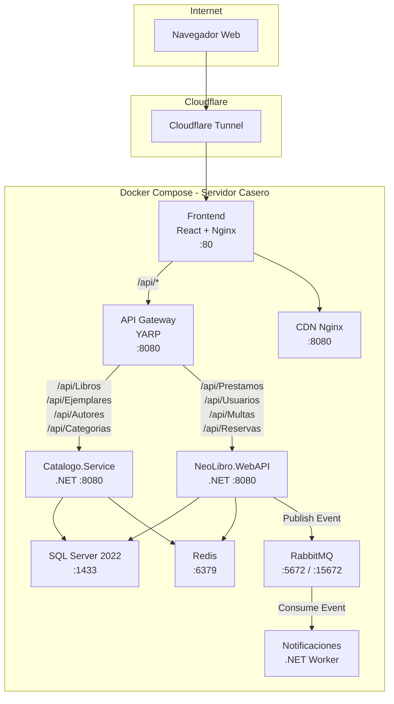
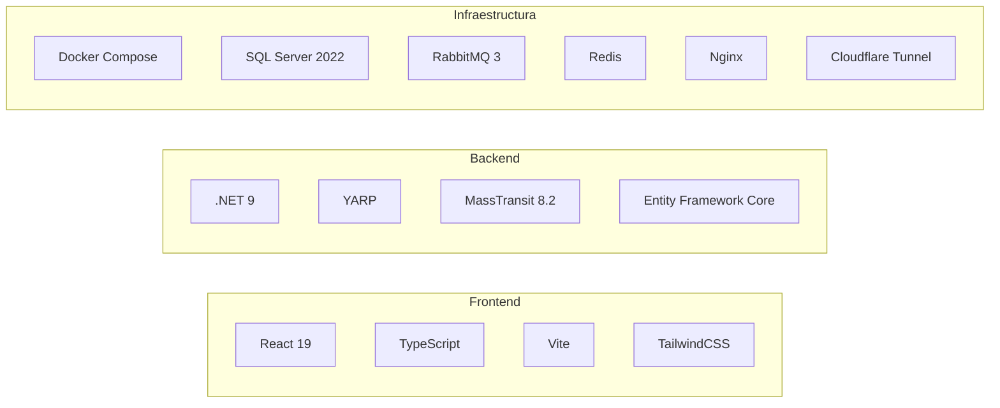

# Sistema de Biblioteca Universitaria — Arquitectura Distribuida

**Taller de Sistemas Distribuidos | FISI - UNMSM**

---

## Descripcion General

Sistema de gestion de biblioteca universitaria que implementa una **arquitectura de microservicios** desplegada con **Docker Compose** sobre un servidor casero, expuesto a internet mediante **Cloudflare Tunnel**.

El sistema parte de un monolito en .NET y lo evoluciona aplicando 6 patrones fundamentales de sistemas distribuidos.

| Capa | Tecnologia |
|---|---|
| Frontend | React 19 + TypeScript + Vite + TailwindCSS |
| API Gateway | .NET 9 con YARP (Reverse Proxy) |
| Monolito | .NET 9 Web API (Prestamos, Usuarios, Multas, Reservas) |
| Microservicio | .NET 9 Web API (Catalogo de Libros) |
| Worker | .NET 9 Background Service (Notificaciones) |
| Mensajeria | RabbitMQ 3 con MassTransit |
| Cache | Redis Alpine |
| CDN | Nginx Alpine (portadas y PDFs) |
| Base de Datos | SQL Server 2022 |
| Orquestacion | Docker Compose (9 contenedores) |

---

## Diagrama de Arquitectura



---

## Las 6 Mejoras de Arquitectura Distribuida

### 1. API Gateway con YARP (Reverse Proxy)

**Que hace:** Punto de entrada unico para todas las peticiones del frontend. Enruta dinamicamente el trafico hacia el microservicio correcto segun la URL.

**Patron:** Single Entry Point / Gateway Routing

| Ruta | Destino |
|---|---|
| `/api/Libros`, `/api/Ejemplares`, `/api/Autores`, `/api/Categorias` | Catalogo.Service |
| `/api/Prestamos`, `/api/Usuarios`, `/api/Multas`, `/api/Reservas` | NeoLibro.WebAPI |

**Justificacion:** El frontend no necesita conocer la ubicacion fisica de cada servicio. Se pueden agregar, mover o escalar microservicios sin modificar el cliente.

---

### 2. Bus de Eventos Asincronos (RabbitMQ + MassTransit)

**Que hace:** Al crear un prestamo, el monolito publica un evento `PrestamoCreadoEvent` en RabbitMQ. El microservicio de Notificaciones lo consume de forma independiente y asincrona.

**Patron:** Event-Driven Architecture / Pub-Sub

```
Monolito                RabbitMQ               Notificaciones.Service
   |                       |                         |
   |-- PrestamoCreadoEvent -->|                      |
   |   (responde al usuario)  |-- consume evento --> |
   |                          |                      |-- simula email
```

**Justificacion:**
- **Desacoplamiento temporal:** El monolito no espera a que se envie el correo para responder al usuario.
- **Tolerancia a fallos:** Si el servicio de notificaciones se cae, los mensajes se acumulan en RabbitMQ y se procesan al reiniciar.

---

### 3. CDN Simulada con Nginx

**Que hace:** Servidor estatico independiente que sirve portadas de libros e imagenes y archivos PDF, desacoplado del backend.

**Patron:** Resource Offloading / Edge Caching

**Justificacion:** Los archivos pesados (imagenes, PDFs) no pasan por la API de negocio. Nginx esta optimizado para transferencia de archivos estaticos, reduciendo la carga del servidor de aplicacion.

---

### 4. Cache Distribuido con Redis

**Que hace:** El microservicio de Catalogo almacena la lista de libros en Redis con TTL de 5 minutos. En la primera peticion consulta SQL Server (Cache Miss); las siguientes responden directamente desde Redis (Cache Hit).

**Patron:** Cache-Aside / Out-of-Process Caching

**Justificacion:**
- **Reduccion de carga:** Evita consultas repetidas a SQL Server para datos de catalogo que cambian con baja frecuencia.
- **Cache compartido:** Al estar en Redis (fuera de proceso), multiples instancias del microservicio comparten el mismo cache.

---

### 5. Separacion de Lectura y Escritura (CQRS a nivel de BD)

**Que hace:** Resuelve dinamicamente la cadena de conexion de la base de datos segun el verbo HTTP:
- `GET` → Conecta a la replica de lectura (`ReadOnlyConnection`)
- `POST / PUT / DELETE` → Conecta a la base principal (`WriteConnection`)

**Patron:** CQRS (Command Query Responsibility Segregation) / Read-Write Split

**Justificacion:** En un sistema de biblioteca, ~90% del trafico son lecturas (consultar catalogo, ver prestamos). Separar las conexiones permite escalar agregando replicas de lectura sin afectar las transacciones de escritura.

---

### 6. Extraccion del Microservicio de Catalogo

**Que hace:** El dominio de libros, ejemplares, autores y categorias se extrajo del monolito a un servicio independiente (`Catalogo.Service`). Cuando el monolito necesita validar un libro para un prestamo, hace una llamada HTTP sincrona al microservicio.

**Patron:** Strangler Fig / Service Extraction

**Justificacion:**
- **Desacoplamiento funcional:** Si el catalogo se cae, el modulo de usuarios y multas sigue operativo.
- **Escalabilidad independiente:** El catalogo recibe la mayoria del trafico; puede escalarse con mas recursos sin tocar el monolito.

---

## Despliegue con Docker Compose

El sistema completo se levanta con un solo comando:

```bash
cd backend
docker compose up -d --build
```

Esto despliega **9 contenedores** interconectados en una red Docker interna:

| Contenedor | Imagen | Puerto expuesto | Funcion |
|---|---|---|---|
| `sqlserver_biblioteca` | SQL Server 2022 | 1433 | Base de datos relacional |
| `rabbitmq_biblioteca` | RabbitMQ 3 | 5672, 15672 | Broker de mensajeria |
| `redis_biblioteca` | Redis Alpine | 6379 | Cache distribuido |
| `cdn_biblioteca` | Nginx Alpine | 8080 | Servidor de archivos estaticos |
| `catalogo_service` | .NET 9 | interno | Microservicio de catalogo |
| `neolibro_webapi` | .NET 9 | interno | Monolito de operaciones |
| `notificaciones_service` | .NET 9 | interno | Worker de notificaciones |
| `api_gateway` | .NET 9 + YARP | interno | Reverse proxy |
| `frontend_biblioteca` | React + Nginx | 80 | Interfaz web |

---

## Datos del Proyecto

- **1,326 libros** importados del catalogo real de la Facultad de Ingenieria de Sistemas (FISI)
- **3,373 ejemplares** fisicos registrados
- **1,083 autores** unicos
- **25 categorias** clasificadas por LCC (Library of Congress Classification)

---

## Flujo de Demostracion

### Paso 1 — API Gateway
Iniciar sesion en la aplicacion web. Todas las peticiones viajan al puerto unico del API Gateway (YARP), que las distribuye transparentemente al microservicio correcto.

### Paso 2 — CDN (Recursos estaticos)
Navegar al catalogo, abrir los detalles de un libro. La portada se carga desde el servidor Nginx independiente (CDN), no desde el backend.

### Paso 3 — Redis Cache (Hit / Miss)
- Primera carga del catalogo: en la terminal se muestra `[SQL] Cache Miss - Consultando base de datos`
- Segunda carga: se muestra `[REDIS] Cache Hit - Libros obtenidos de memoria` (respuesta instantanea)

### Paso 4 — Separacion Read/Write
- Navegar por la aplicacion (GET): en la terminal se muestra `[DB-READ] Conectando a replica de lectura...`
- Crear un prestamo (POST): se muestra `[DB-WRITE] Ejecutando transaccion en BD principal...`

### Paso 5 — Bus de Eventos (RabbitMQ)
Al confirmar el prestamo, observar la terminal del servicio de Notificaciones:
```
NUEVO EVENTO RECIBIDO: PrestamoCreadoEvent
   ID Prestamo: 124 | ID Usuario: 1
   Libro: LOGICA MATEMATICA un enfoque axiomatico
   Simulacion: Enviando email a admin@unmsm.edu.pe...
```
El monolito publico el evento y libero al usuario; el worker lo proceso de forma asincrona.

---

## Repositorio y Acceso

| Recurso | URL |
|---|---|
| Repositorio | https://github.com/EdsonPerez7/biblio_distribuidos |
| Aplicacion en vivo | *(via Cloudflare Tunnel)* |
| Panel RabbitMQ | `http://IP_SERVIDOR:15672` (guest/guest) |

---

## Stack Tecnologico Completo


